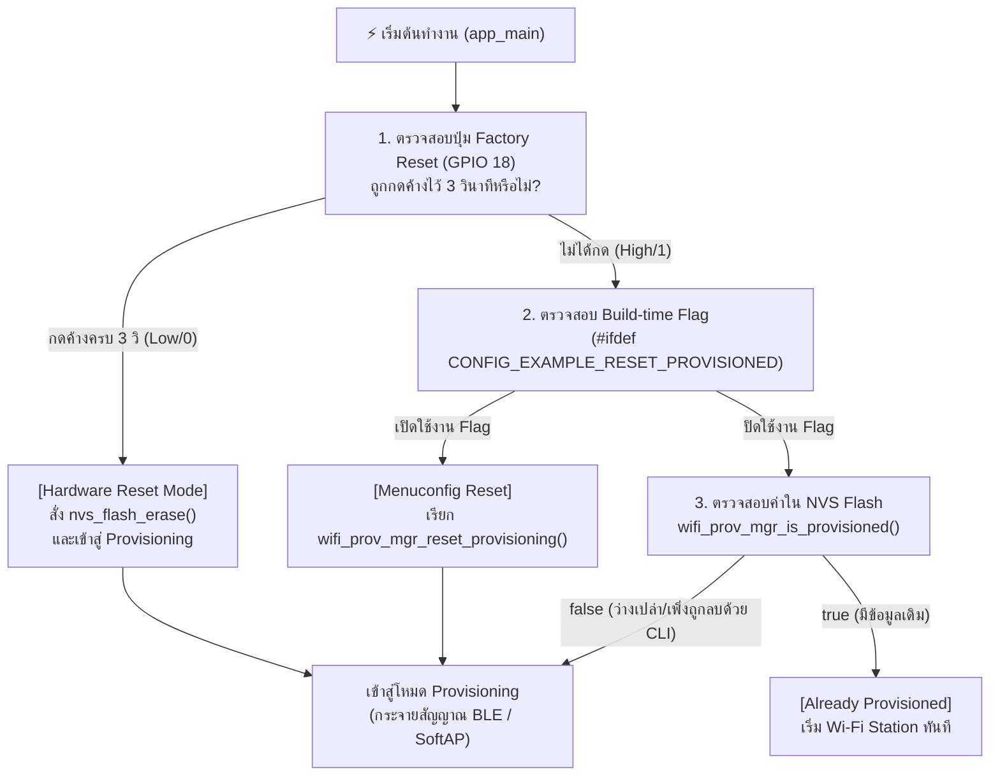

# ใบงานที่ 7.1  การศึกษากลไก Reset Provisioning 3 รูปแบบ และ NVS Memory Forensics

## 0. กล่าวนำ (Introduction)
เมื่ออุปกรณ์ ESP32 ผ่านการ Provisioning สำเร็จแล้ว ข้อมูล Wi-Fi จะถูกบันทึกไว้ใน NVS Flash Memory อย่างถาวร เมื่อเปิดเครื่องใหม่ เฟิร์มแวร์จะเข้าสู่สถานะ `Already provisioned` และข้ามขั้นตอนการรับข้อมูลใหม่ไปทันที

ในการพัฒนาผลิตภัณฑ์และการทดสอบความปลอดภัย วิศวกรจำเป็นต้องทราบวิธีการล้างค่าคอนฟิก (Factory Reset / Erase Credentials) ซึ่งในใบงานนี้นักศึกษาจะได้ทดลองและเปรียบเทียบกลไกการ Reset ครบทั้ง 3 รูปแบบ:
1. **Developer CLI Reset:** การล้างผ่านคำสั่ง Command Line บนเครื่องคอมพิวเตอร์
2. **Build-time Firmware Reset:** การกำหนดค่าผ่าน `menuconfig`
3. **Consumer Hardware Reset:** การต่อสวิตช์ปุ่มกดภายนอก (**External Pushbutton บน GPIO 18**) เพื่อใช้เป็นปุ่ม Factory Reset ทางกายภาพ เสมือนอุปกรณ์ IoT เชิงพาณิชย์จริง (หลีกเลี่ยงการใช้ปุ่ม BOOT/GPIO 0 ที่เป็น Strapping Pin)

---

## 1. วัตถุประสงค์ (Objectives)
1. ศึกษาและทำความเข้าใจสถานะ `Already provisioned` และการตัดสินใจของ `wifi_prov_mgr_is_provisioned()`
2. สามารถล้างข้อมูลการเชื่อมต่อใน Flash Memory ผ่านคำสั่ง CLI (`idf.py erase-flash` และ `esptool.py`) ได้
3. สามารถกำหนดค่า Build Configuration ใน `menuconfig` เพื่อสั่งรีเซ็ต State Machine ได้
4. เข้าใจข้อจำกัดของ **Strapping Pins (GPIO 0 / Bootloader Trap)** และสามารถต่อสวิตช์ปุ่มกดภายนอก (GPIO 18) เพื่อเขียนโปรแกรม Factory Reset ทางกายภาพได้อย่างถูกต้อง

---

## 2. อุปกรณ์ที่ใช้ในการทดลอง (Equipment)
1. บอร์ดไมโครคอนโทรลเลอร์ ESP32 พร้อมสาย USB
2. สวิตช์ปุ่มกด (Tactile Pushbutton Switch) จำนวน 1 ตัว พร้อมสายต่อ Breadboard
3. ESP-IDF Command Prompt (VS Code Terminal)

> [!IMPORTANT]
> **ทำไมจึงไม่ใช้ปุ่ม BOOT (GPIO 0) กดค้างตอนรีเซ็ตบอร์ด?**
> ขา **GPIO 0** บน ESP32 ทำหน้าที่เป็น **Strapping Pin** สำหรับเลือกโหมดการบูต หากขา GPIO 0 มีสถานะเป็น `LOW (0)` ในจังหวะที่บอร์ดถูกรีเซ็ตหรือจ่ายไฟ ชิป ESP32 จะเข้าสู่โหมด **ROM Download Bootloader** (`waiting for download`) ทันที ทำให้ตัวประมวลผลหยุดรอการแฟลชโปรแกรมและไม่รันโค้ด `app_main()` 
> 
> ดังนั้น ในการออกแบบอุปกรณ์เชิงพาณิชย์ จึงนิยมใช้ขา GPIO ทั่วไป (เช่น **GPIO 18**) ต่อร่วมกับปุ่มกดภายนอกเพื่อทำ Factory Reset แทน

---

## 3. สถาปัตยกรรมและการต่อวงจร (Hardware Wiring & Flow)

### 3.1 การต่อวงจรปุ่มกด Factory Reset (GPIO 18)
- ขาหนึ่งของสวิตช์ปุ่มกด $\rightarrow$ ต่อเข้าขา **GPIO 18** ของ ESP32
- อีกขาหนึ่งของสวิตช์ $\rightarrow$ ต่อลง **GND**
*(เปิดใช้งาน Internal Pull-up Resistor ในโค้ด จึงไม่ต้องต่อตัวต้านทานภายนอกเพิ่ม)*



---

## 4. ขั้นตอนการทดลอง (Step-by-Step Procedures)

### ตอนที่ 1 การล้าง Flash ผ่าน Command Line (Developer Level)
1. เสียบสาย USB เข้ากับคอมพิวเตอร์ ตรวจสอบหมายเลขพอร์ต COM (เช่น `COM24`)
2. เปิด Terminal ในโฟลเดอร์โปรเจกต์ `Week-07-W-iFi-Privisioning/Example_codes/Lab7-1-Reset-and-NVS-Forensics`
3. สั่งล้าง Flash Memory ทั้งหมดของชิปด้วยคำสั่ง:
   ```powershell
   idf.py -p COM24 erase-flash
   ```
4. ทำการ Flash โปรแกรมและเปิด Serial Monitor:
   ```powershell
   idf.py -p COM24 flash monitor
   ```
5. สังเกต Log ว่า ESP32 จะรายงานสถานะ `"Starting provisioning"` และสร้าง QR Code ขึ้นมาบนหน้าจอ

---

### ตอนที่ 2 การบังคับ Reset ผ่าน Menuconfig (Firmware Configuration Level)
1. กดปุ่ม `Ctrl + ]` เพื่อออกจาก Serial Monitor
2. เปิดหน้าต่างคอนฟิกโปรเจกต์:
   ```powershell
   idf.py menuconfig
   ```
3. ใช้ปุ่มลูกศรเลื่อนไปที่หัวข้อ **Example Configuration**
4. เลื่อนไปที่บรรทัด **`Reset Provisioned state (Erase credentials)`** แล้วกดปุ่ม `Spacebar` เพื่อเลือกให้มีเครื่องหมาย `[*]`
5. กดปุ่ม `S` เพื่อบันทึก และ `Q` เพื่อออกจากเมนู
6. สั่ง Build และ Flash โปรแกรม:
   ```powershell
   idf.py -p COM24 flash monitor
   ```
7. สังเกตผลลัพธ์ใน Log: บอร์ดจะทำการล้าง Credentials เก่าทิ้งทุกครั้งที่เปิดเครื่องใหม่

---

### ตอนที่ 3 การสร้างปุ่ม Factory Reset ด้วยฮาร์ดแวร์ภายนอก (GPIO 18)

1. นำสวิตช์ปุ่มกดต่อเข้ากับขา **GPIO 18** และ **GND**
2. เพิ่มฟังก์ชันตรวจสอบปุ่ม Factory Reset ลงในไฟล์ `main/main.c`:

```c
#include "driver/gpio.h"

#define FACTORY_RESET_BUTTON_GPIO  GPIO_NUM_18   // ปุ่ม Factory Reset ภายนอก (ต่อลง GND)

static bool check_factory_reset_button(void)
{
    // กำหนดค่า GPIO 18 เป็น Input พร้อมเปิด Internal Pull-up Resistor
    gpio_config_t io_conf = {
        .pin_bit_mask = (1ULL << FACTORY_RESET_BUTTON_GPIO),
        .mode = GPIO_MODE_INPUT,
        .pull_up_en = GPIO_PULLUP_ENABLE,
        .pull_down_en = GPIO_PULLDOWN_DISABLE,
        .intr_type = GPIO_INTR_DISABLE,
    };
    gpio_config(&io_conf);

    ESP_LOGI("FACTORY_RESET", "Hold GPIO 18 button for 3 seconds to trigger Factory Reset...");
    
    // ตรวจสอบสถานะปุ่มกดค้าง (Active Low / Logic 0)
    int hold_count = 0;
    while (gpio_get_level(FACTORY_RESET_BUTTON_GPIO) == 0) {
        vTaskDelay(pdMS_TO_TICKS(100));
        hold_count++;
        if (hold_count % 10 == 0) {
            ESP_LOGI("FACTORY_RESET", "Holding button... %d/3 seconds", hold_count / 10);
        }
        if (hold_count >= 30) { // กดค้างครบ 3 วินาที (30 x 100ms)
            ESP_LOGW("FACTORY_RESET", "=================================================");
            ESP_LOGW("FACTORY_RESET", ">>> FACTORY RESET TRIGGERED! ERASING NVS FLASH <<<");
            ESP_LOGW("FACTORY_RESET", "=================================================");
            return true;
        }
    }
    return false;
}
```

3. เรียกใช้งานในตอนเริ่มต้นของฟังก์ชัน `app_main()`:

```c
void app_main(void)
{
    // ตรวจสอบการกดปุ่ม Factory Reset ทางกายภาพ (GPIO 18)
    if (check_factory_reset_button()) {
        ESP_ERROR_CHECK(nvs_flash_erase());
    }

    /* Initialize NVS partition */
    esp_err_t ret = nvs_flash_init();
    if (ret == ESP_ERR_NVS_NO_FREE_PAGES || ret == ESP_ERR_NVS_NEW_VERSION_FOUND) {
        ESP_ERROR_CHECK(nvs_flash_erase());
        ESP_ERROR_CHECK(nvs_flash_init());
    }
    // ... โค้ดเดิมต่อจากนี้ ...
```

#### การทดสอบ:
1. ปล่อยให้บอร์ดทำงานปกติ $\rightarrow$ บอร์ดจะจำค่าเดิมได้ (`Already provisioned`)
2. กดปุ่มที่ต่อกับ **GPIO 18 ค้างไว้ 3 วินาที** จากนั้นกดรีเซ็ตบอร์ด หรือกดค้างขณะเปิดเครื่อง
3. สังเกต Serial Monitor: ระบบจะตรวจพบการกดค้าง 3 วินาที และสั่งล้าง NVS Flash เพื่อกลับสู่โหมด Provisioning ทันที!

---

---

## 5. กิจกรรมถอดรหัสซอร์สโค้ดและเขียนผังงาน (Code Deconstruction & Flowchart Assignment)

ให้นักศึกษาศึกษาโค้ดใน `main/main.c` และ `main/led_indicator.c` แล้วเขียน **ผังงาน (Flowchart / State Diagram)** เพื่ออธิบายการตัดสินใจและการทำงานของระบบ:

### ภารกิจที่ 1  ผังงานการตัดสินใจช่วง Bootstrapping & Reset Decision
ให้นักศึกษาวาด Flowchart แสดงลำดับตรรกะการตรวจสอบเงื่อนไขตั้งแต่เริ่มต้นรันฟังก์ชัน `app_main()` โดยต้องครอบคลุม:
1. การตรวจสอบสถานะปุ่ม **GPIO 18** (ตรวจจับการกดค้าง 3 วินาที)
2. การทำงานของ `nvs_flash_init()` และกรณีที่ต้อง `nvs_flash_erase()`
3. การตรวจสอบ Macro `#ifdef CONFIG_EXAMPLE_RESET_PROVISIONED`
4. การเรียกฟังก์ชัน `wifi_prov_mgr_is_provisioned(&provisioned)`
5. จุดแยกสายการทำงานเข้าสู่โหมด **Provisioning Mode** หรือ **Station Mode**

### ภารกิจที่ 1 ผังงานการตัดสินใจช่วง Bootstrapping & Reset Decision

```mermaid
flowchart TD
    Start([เริ่มต้นรัน app_main]) --> ConfigBtn[กำหนดค่า GPIO 18 เป็น Input พร้อมเปิด Pull-up]
    ConfigBtn --> CheckBtn{ตรวจสอบ GPIO 18<br>ถูกกดค้างครบ 3 วินาทีหรือไม่?}
    
    CheckBtn -- ใช่ (Active Low) --> EraseNVS1[สั่ง nvs_flash_erase เพื่อล้าง NVS ทั้งหมด]
    CheckBtn -- ไม่ใช่ --> InitNVS
    EraseNVS1 --> InitNVS[สั่ง nvs_flash_init]
    
    InitNVS --> CheckNVSErr{เกิดข้อผิดพลาด<br>NO_FREE_PAGES หรือ NEW_VERSION_FOUND?}
    CheckNVSErr -- ใช่ --> EraseNVS2[สั่ง nvs_flash_erase แล้ว nvs_flash_init ซ้ำ]
    CheckNVSErr -- ไม่ใช่ --> InitNetif
    EraseNVS2 --> InitNetif
    
    InitNetif[เริ่มต้น TCP/IP Stack, Event Loop และ Wi-Fi Driver] --> CheckMacro{#ifdef CONFIG_EXAMPLE_RESET_PROVISIONED?}
    
    CheckMacro -- มีการกำหนด Macro --> ResetMgr[สั่ง wifi_prov_mgr_reset_provisioning]
    CheckMacro -- ไม่มีการกำหนด Macro --> CheckProv
    ResetMgr --> CheckProv
    
    CheckProv[เรียกฟังก์ชัน wifi_prov_mgr_is_provisioned] --> IsProv{ค่า provisioned == true?}
    
    IsProv -- false (ยังไม่ตั้งค่า) --> ProvMode[เข้าสู่โหมด Provisioning Mode<br>- สร้าง SoftAP / BLE Service<br>- แสดง QR Code บน Terminal<br>- เปิด Endpoint รับ Credentials<br>- LED กระพริบโหมดรอเชื่อมต่อ]
    IsProv -- true (ตั้งค่าไว้แล้ว) --> StaMode[เข้าสู่โหมด Station Mode ปกติ<br>- คืนทรัพยากร wifi_prov_mgr_deinit<br>- เชื่อมต่อ Wi-Fi AP ที่บันทึกไว้ใน NVS<br>- LED แสดงผล Heartbeat เมื่อได้ IP]

### ภารกิจที่ 2 ผังสถานะการเปลี่ยนจังหวะไฟ LED 1 (Wi-Fi STA Indicator)
ให้นักศึกษาวาด State Diagram แสดงการเปลี่ยนสถานะของ **LED 1 (GPIO 2)**:
- เงื่อนไขใดทำให้ LED 1 เข้าสู่สถานะ `LED_STA_MODE_DISCONNECTED` (กระพริบ 200ms Mark / 200ms Space)
- เงื่อนไขหรือ Event ใดทำให้เปลี่ยนเป็น `LED_STA_MODE_CONNECTED` (Heartbeat 200ms ทุก 1s)

stateDiagram-v2
    [*] --> LED_STA_MODE_OFF : เริ่มต้นระบบ (Bootstrapping)
    
    LED_STA_MODE_OFF --> LED_STA_MODE_DISCONNECTED : Wi-Fi เริ่มทำงาน (WIFI_EVENT_STA_START)
    
    state LED_STA_MODE_DISCONNECTED {
        [*] --> FastBlink : สลับสถานะ ติด 200ms / ดับ 200ms ต่อเนื่อง
        note right of FastBlink : อยู่ระหว่างพยายามเชื่อมต่อ AP หรือการเชื่อมต่อหลุด
    }
    
    LED_STA_MODE_DISCONNECTED --> LED_STA_MODE_CONNECTED : ได้รับ IP สำเร็จ (IP_EVENT_STA_GOT_IP)
    
    state LED_STA_MODE_CONNECTED {
        [*] --> HeartbeatPulse : สว่างวาบ (Pulse) 200ms ทุกๆ รอบ 1000ms
        note right of HeartbeatPulse : เชื่อมต่อเครือข่ายสำเร็จและพร้อมใช้งาน
    }
    
    LED_STA_MODE_CONNECTED --> LED_STA_MODE_DISCONNECTED : การเชื่อมต่อขาดหาย (WIFI_EVENT_STA_DISCONNECTED)
---

## 6. ตารางบันทึกผลการทดลอง (Experiment Results)

| รูปแบบการ Reset | คำสั่ง / พฤติกรรมที่ทำ | พฤติกรรมของ LED แต่ละดวงหลังเปิดเครื่อง | สถานะใน Serial Monitor |
| :------------------------------- | :----------------------------------- | :-------------------------------------- | :--------------------- |
| **1. CLI Erase** | `idf.py erase-flash` | - **LED 1 (GPIO 2):** ดับระหว่างล้าง เมื่อแฟลชใหม่จะกระพริบเร็ว (200ms Mark / 200ms Space)<br>- **LED 2 (Prov):** สว่าง/กระพริบเข้าสู่สถานะรอรับ Provisioning | ชิปถูกล้างข้อมูลทุก Partition หลังแฟลชใหม่จะขึ้น `Starting provisioning` และแสดงรหัส QR Code บนหน้าจอ Terminal |
| **2. Menuconfig Flag** | `CONFIG_EXAMPLE_RESET_PROVISIONED=y` | - **LED 1 (GPIO 2):** กระพริบเร็วต่อเนื่อง (200ms)<br>- **LED 2 (Prov):** สว่างเข้าสู่โหมด Provisioning ทุกครั้งที่บูตเครื่อง | แสดง Log: `Reset provisioned state` โดยระบบจะสั่งล้าง Credentials เดิมทิ้งทุกครั้งที่เปิดเครื่อง ทำให้วนกลับมารอรับการตั้งค่าใหม่อยู่เสมอ |
| **3. Hardware Button (GPIO 18)** | กดปุ่ม GPIO 18 ค้าง 3 วินาที | - ขณะกดค้าง: LED ค้างตามสถานะเดิม<br>- ครบ 3 วินาทีแล้วปล่อย: LED 2 เปลี่ยนเข้าสู่โหมด Provisioning | แสดง Log: `Holding button... 1/3, 2/3, 3/3 seconds` ตามด้วย `FACTORY RESET TRIGGERED! ERASING NVS FLASH` และระบบเริ่มกระบวนการ Provisioning ใหม่ทันที |

---

## 7. คำถามท้ายการทดลอง (Post-Lab Questions)

1. **เพราะเหตุใดการกดปุ่ม BOOT (GPIO 0) ค้างไว้ในจังหวะรีเซ็ตบอร์ด จึงทำให้โปรแกรมค้างอยู่ที่ ROM Bootloader และไม่ยอมทำงานต่อ?**
   * **เหตุผลทางฮาร์ดแวร์:** ขา GPIO 0 บนชิป ESP32 ทำหน้าที่เป็น **Strapping Pin** สำหรับเลือกโหมดการบูต (Boot Mode Selection) ของตัวประมวลผล
   * ในจังหวะที่วงจร Reset ถูกปล่อย (ขอบขาขึ้นของสัญญาณ EN/CHIP_PU) ตัวฮาร์ดแวร์ ROM ภายในจะสุ่มอ่านระดับแรงดันลอจิกที่ขา GPIO 0 ทันที:
     * หาก GPIO 0 เป็น **HIGH (1)**: ชิปจะทำงานในโหมด `SPI Boot` เพื่อโหลดและรันเฟิร์มแวร์ Application จากชิป Flash ตามปกติ
     * หาก GPIO 0 เป็น **LOW (0)**: ตัวประมวลผลจะถูกบังคับให้เข้าสู่โหมด **ROM Download Bootloader (UART Bootloader)** ทันที เพื่อรอรับคำสั่งแฟลชโปรแกรมใหม่ผ่านพอร์ต UART ส่งผลให้ CPU ค้างรอการสื่อสารและไม่ยอมกระโดดไปรันโค้ดใน `app_main()`

2. **เพราะเหตุใดคำสั่ง `idf.py erase-flash` จึงทำให้ข้อมูลเฟิร์มแวร์ Application หายไปด้วย ในขณะที่ `nvs_flash_erase()` ไม่ทำให้เฟิร์มแวร์หาย?**
   * **ขอบเขตการทำงานระดับพาร์ติชัน (Partition Scope):**
     * **`idf.py erase-flash`:** เป็นคำสั่งระดับเครื่องมือ esptool ที่สั่งล้างข้อมูล (Sector/Chip Erase) ทางกายภาพ **ทั่วทั้งชิป SPI Flash ตั้งแต่แอดเดรส 0x00000000 จนถึงไบต์สุดท้าย** ส่งผลให้ Partition Table, Bootloader, Binary Application (`app0`/`app1`) และข้อมูลคอนฟิก NVS ถูกลบทิ้งทั้งหมดจนบอร์ดว่างเปล่า
     * **`nvs_flash_erase()`:** เป็นฟังก์ชันระดับซอฟต์แวร์ API ในระบบ ESP-IDF ซึ่งจะอ้างอิงตำแหน่งตามตาราง Partition Table และสั่งล้างบล็อกข้อมูล **เฉพาะเซกเตอร์ที่อยู่ในพาร์ติชันชื่อ `nvs`** เท่านั้น โดยไม่ไปแตะต้องหรือเขียนทับพื้นที่ของพาร์ติชัน Application ตัวเฟิร์มแวร์จึงคงอยู่สมบูรณ์และบูตขึ้นมาทำงานต่อได้ตามปกติ

3. **การออกแบบปุ่ม Factory Reset บนอุปกรณ์ IoT เชิงพาณิชย์ เหตุใดจึงต้องกำหนดให้ผู้ใช้กดปุ่มค้างไว้ 3-5 วินาที แทนที่จะสั่งลบข้อมูลทันทีที่แตะปุ่มเพียงเสี้ยววินาที?**
   * **การป้องกันความผิดพลาดจากการสัมผัสโดยไม่เจตนา (Accidental Triggering):** ป้องกันไม่ให้การตั้งค่าสำคัญและการเชื่อมต่อเครือข่ายสูญหายเมื่อผู้ใช้เผลอกดโดนปุ่มขณะเคลื่อนย้าย ติดตั้ง หรือทำความสะอาด
   * **การกรองสัญญาณรบกวนทางกลไก (Contact Debounce & Electrical Transients):** หน้าสัมผัสของสวิตช์ปุ่มกดอาจเกิดสัญญาณสะท้อน (Switch Bouncing) หรือคลื่นไฟฟ้ารบกวนชั่วขณะ การหน่วงเวลาตรวจสอบ 3–5 วินาทีช่วยยืนยันเจตนาของผู้ใช้ได้อย่างแม่นยำ
   * **การใช้งานแบบปุ่มมัลติฟังก์ชัน (Multi-function Handling):** ช่วยให้อุปกรณ์สามารถใช้ปุ่มทางกายภาพเพียงปุ่มเดียวทำหน้าที่ได้หลายอย่าง เช่น การกดปล่อยสั้น (< 1 วินาที) สำหรับ Wake-up / เปิด-ปิดไฟ และการกดค้างยาว (> 3 วินาที) สำหรับการล้างค่าระบบ (Factory Reset)

4. **หากอุปกรณ์ IoT ถูกติดตั้งอยู่บนเสาสูงหรือฝังอยู่ในผนัง วิธีการ Reset ทางกายภาพรูปแบบใดเหมาะสมที่สุด?**
   * **Power Cycle Sequencing (การเปิด-ปิดสวิตช์ไฟหลักเป็นจังหวะ):** กำหนดให้ผู้ใช้ตัดและจ่ายไฟเข้าอุปกรณ์ติดต่อกันตามลำดับที่กำหนด (เช่น ปิด-เปิด 5 ครั้งต่อเนื่องกัน แต่ละครั้งห่างกันไม่เกิน 2–3 วินาที) โดยเฟิร์มแวร์จะเขียนตัวนับ (Counter) ลงใน RTC Fast Memory หรือ NVS เพื่อตรวจสอบเงื่อนไขและสั่ง Factory Reset อัตโนมัติ (เป็นวิธีมาตรฐานสากลที่ใช้ในหลอดไฟ Smart Bulb)
   * **Magnetic Reed Switch / Hall Effect Sensor:** ติดตั้งสวิตช์ตรวจจับสนามแม่เหล็กไว้ภายในตัวกล่องปิดผนึก (Hermetically Sealed Enclosure) เมื่อต้องการรีเซ็ต ผู้ดูแลเพียงนำแท่งแม่เหล็กแรงสูงไปแนบตรงตำแหน่งที่กำหนดจากภายนอกกล่อง โดยไม่ต้องปีนรื้อแกะฝาครอบกันน้ำ (IP67/IP68)
   * **OTA Management Command:** สั่งรีเซ็ตและล้างค่าผ่านเครือข่ายระยะไกล หรือใช้สัญญาณ BLE Beacon สำรอง (Fallback Beacon) ส่งคำสั่งล้างค่าทางคลื่นวิทยุ