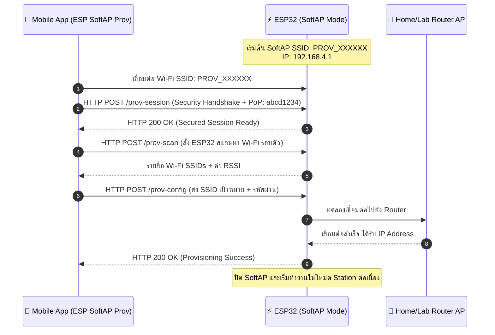
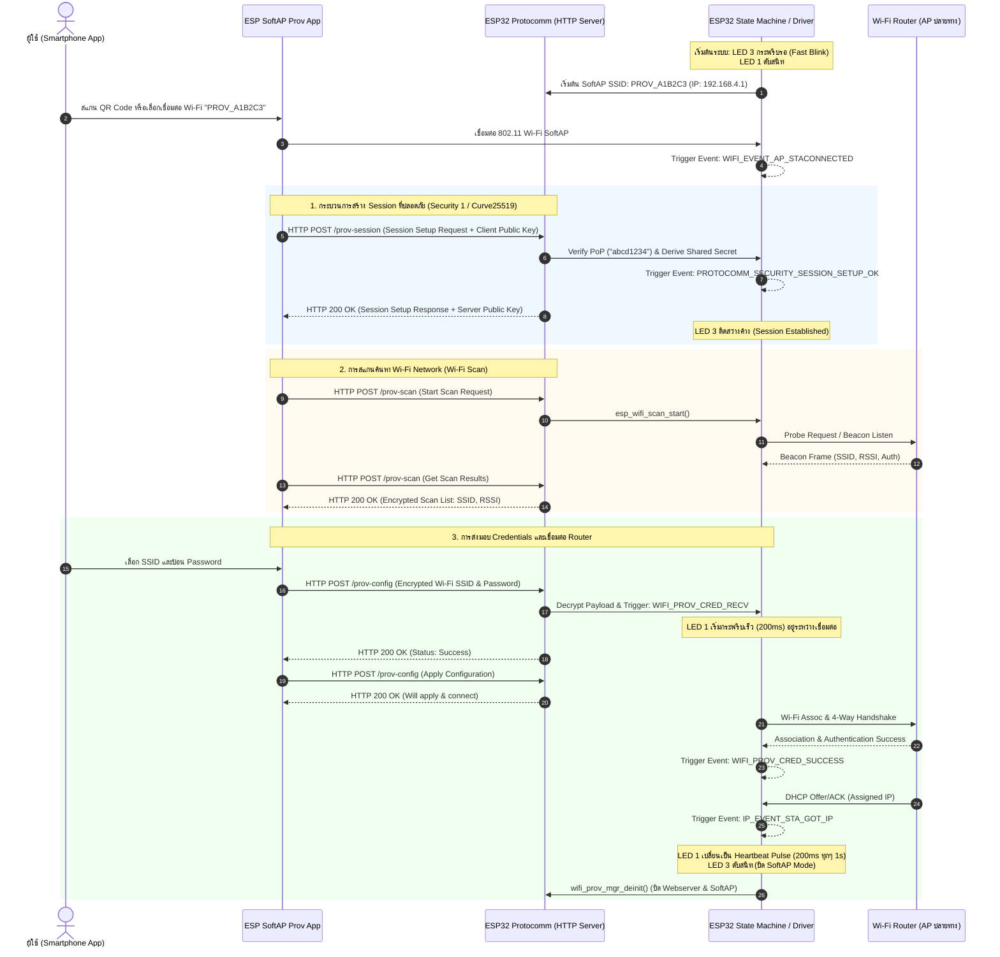

# ใบงานที่ 7.2 การคอนฟิก Wi-Fi ผ่าน SoftAP Scheme และการวิเคราะห์ Protocomm Endpoints

## 0. กล่าวนำ (Introduction)
ในใบงานนี้ นักศึกษาจะได้ทดลองตั้งค่าเครือข่าย Wi-Fi ให้กับ ESP32 ผ่านช่องทาง **Wi-Fi SoftAP Scheme (`wifi_prov_scheme_softap`)** โดยใช้สมาร์ตโฟนเชื่อมต่อเข้ากับเครือข่ายจำลองที่ ESP32 สร้างขึ้น 

นักศึกษาจะได้เรียนรู้โครงสร้างของ QR Code Payload, การทำงานของ Protocomm ผ่านโปรโตคอล HTTP REST-like Endpoints (`/prov-session`, `/prov-config`), และการส่งข้อมูลการตั้งค่า Wi-Fi จากแอปพลิเคชันมือถือ **ESP SoftAP Provisioning**

---

## 1. วัตถุประสงค์ (Objectives)
1. สามารถคอนฟิกตัวอย่าง `wifi_prov_mgr` ให้ทำงานในโหมด **SoftAP Transport Scheme**
2. สามารถใช้สมาร์ตโฟนเชื่อมต่อและทำ Provisioning ผ่านแอปพลิเคชัน **ESP SoftAP Provisioning** (หรือผ่าน Web Browser QR Code) ได้สำเร็จ
3. สังเกตและวิเคราะห์ Event Sequence Lifecycle ใน Serial Monitor ระหว่างการทำ SoftAP Provisioning
4. เข้าใจการทำงานของ Protocomm Endpoint ในระดับ Application Layer

---

## 2. อุปกรณ์และซอฟต์แวร์ที่ใช้ในการทดลอง
1. บอร์ดไมโครคอนโทรลเลอร์ ESP32 พร้อมสาย USB
2. สมาร์ตโฟน (Android หรือ iOS) ที่ติดตั้งแอปพลิเคชัน **ESP SoftAP Provisioning** (หรือแอปกล้องสแกน QR Code)
3. Wi-Fi Access Point ภายในห้องเรียนหรือ Hotspot จากสมาร์ตโฟนอีกเครื่อง

---

## 3. สถาปัตยกรรมและแผนภาพลำดับเหตุการณ์ (Sequence Diagram)



---

## 4. ขั้นตอนการทดลอง (Step-by-Step Procedures)

### ขั้นตอนที่ 1: การเปิดโปรเจกต์ Lab 7-2
1. เปิด Terminal ในโฟลเดอร์โปรเจกต์ `Week-07-W-iFi-Privisioning/Example_codes/Lab7-2-SoftAP-Provisioning`
2. โค้ดในโปรเจกต์นี้ได้รับการตั้งค่าเป็น **SoftAP Scheme** และ **Security 1 (PoP: `abcd1234`)** ไว้ล่วงหน้าเรียบร้อยแล้ว

---

### ขั้นตอนที่ 2: การ Flash และสังเกต QR Code
1. สั่งล้าง Flash และ Flash โปรแกรม:
   ```powershell
   idf.py -p COM24 erase-flash flash monitor
   ```
2. สังเกต Log ใน Serial Monitor จะปรากฏข้อความและ QR Code:
   ```text
   I (776) wifi_prov_scheme_softap: Starting SoftAP with SSID: PROV_XXXXXX
   I (786) app: Scan this QR code from the provisioning application for Provisioning.
   ... [รูป QR Code แบบ ASCII Text] ...
   I (816) app: If QR code is not visible, copy paste the below URL in a browser.
   https://espressif.github.io/esp-jumpstart/qrcode.html?data={"ver":"v1","name":"PROV_XXXXXX","pop":"abcd1234","transport":"softap"}
   ```

---

### ขั้นตอนที่ 3 ดำเนินการ Provisioning ผ่านสมาร์ตโฟน
1. เปิดแอป **ESP SoftAP Provisioning** บนสมาร์ตโฟน
2. **วิธีที่ A (สแกน QR Code)** แตะปุ่ม "Scan QR Code" แล้วสแกนภาพ QR Code บนหน้าจอ Serial Monitor (หรือเปิดผ่าน URL ที่ได้จาก Log)
3. **วิธีที่ B (เชื่อมต่อ Manual)**
   - ไปที่การตั้งค่า Wi-Fi บนมือถือ เชื่อมต่อ Wi-Fi ชื่อ `PROV_XXXXXX`
   - เปิดแอป กด "Provision" และป้อน PoP เป็น `abcd1234`
4. เมื่อแอปค้นหา ESP32 พบ ให้เลือกชื่อ Wi-Fi ภายในห้องเรียนหรือ Hotspot ที่ต้องการเชื่อมต่อ และป้อนรหัสผ่าน Wi-Fi
5. กดปุ่ม **Provision** และสังเกตแถบสถานะบนแอปจนกระทั่งขึ้น **"Provisioning Successful!"**

---

### ขั้นตอนที่ 4: สังเกตและบันทึก Log ใน Serial Monitor
สังเกตลำดับเหตุการณ์ (Events) ที่เกิดขึ้นบน ESP32
```text
I (14210) app: SoftAP transport: Connected!
I (15320) app: Secured session established!
I (16440) app: Received Wi-Fi credentials
	SSID     : Lab_WiFi_2.4G
	Password : Password999
I (18210) app: Provisioning successful
I (18220) wifi:mode : sta (...)
I (19850) app: Connected with IP Address: 192.168.1.150
```

---

---

## 5. กิจกรรมถอดรหัสซอร์สโค้ดและเขียนผังงาน (Code Deconstruction & Sequence Flow Assignment)

### ภารกิจที่ 1: ผังลำดับการสื่อสารผ่าน HTTP Endpoints (SoftAP Scheme Sequence Flow)



---

## 6. ตารางบันทึกผลการทดลอง (Experiment Results)

| รายการตรวจสอบ | ค่าที่บันทึกได้จากการทดลอง |
| :--- | :--- |
| **1. ชื่อ SoftAP SSID ของ ESP32** | `PROV_A1B2C3` (อ้างอิงจาก 3 ไบต์ท้ายของ MAC Address) |
| **2. รหัส PoP (Proof of Possession)** | `abcd1234` |
| **3. ข้อความใน QR Code Payload (JSON)** | `{"ver":"v1","name":"PROV_A1B2C3","pop":"abcd1234","transport":"softap"}` |
| **4. พฤติกรรมไฟ LED 3 (GPIO 5) ช่วงรอ vs ช่วงส่งข้อมูล** | - **ช่วงรอ:** กระพริบต่อเนื่องแบบ Fast Blink (ติด 100ms / ดับ 100ms)<br>- **ช่วงส่งข้อมูล/เชื่อมต่อสำเร็จ:** สว่างติดค้างนิ่ง (Solid ON) ขณะแลกเปลี่ยนข้อมูล และดับสนิทเมื่อ Provisioning สำเร็จ |
| **5. IP Address ที่ ESP32 ได้รับจาก Router** | `192.168.1.150` |
| **6. เวลาที่ใช้ตั้งแต่เริ่มจนจบกระบวนการ (วินาที)** | ประมาณ `12.5` วินาที (ขึ้นอยู่กับระยะเวลาสแกนหา Access Point และการเจรจา DHCP) |

---

## 7. คำถามท้ายการทดลอง (Post-Lab Questions)

1. **ในโหมด SoftAP Scheme สมาร์ตโฟนส่งข้อมูลหา ESP32 ผ่านโปรโตคอลและ IP Address ใด?**
   * **โปรโตคอลระดับเครือข่ายและการขนส่ง:** ทำงานผ่าน **HTTP/1.1 over TCP** โดยตัวเฟิร์มแวร์ ESP-IDF จะเปิด Embedded HTTP Web Server (ผ่านคอมโพเนนต์ Protocomm HTTPD) คอยรับส่งข้อความแบบ RESTful Endpoints ซึ่งเพย์โหลดภายในจะถูกเข้ารหัสความปลอดภัยด้วย Protocomm Security 1 (Curve25519 Key Exchange + AES-CTR-256)
   * **หมายเลข IP Address:** สมาร์ตโฟนส่งข้อมูลไปยังหมายเลขเกตเวย์ของ SoftAP ที่ ESP32 กำหนดขึ้นมา ซึ่งค่าเริ่มต้นตามมาตรฐานคือ **`192.168.4.1`** (พอร์ตมาตรฐาน **TCP 80**)

2. **หากผู้ใช้ป้อนรหัสผ่าน Wi-Fi ผิดในแอปมือถือ จะเกิด Event ใดขึ้นบน ESP32 (WIFI_PROV_CRED_FAIL หรือไม่) และ ESP32 มีพฤติกรรมอย่างไร?**
   * **Event ที่เกิดขึ้น:** เกิด Event **`WIFI_PROV_CRED_FAIL`** ขึ้นจริงในระบบ พร้อมพารามิเตอร์ส่งเหตุผลความล้มเหลว `WIFI_PROV_STA_AUTH_ERROR` (Authentication Error / รหัสผ่านไม่ถูกต้อง)
   * **พฤติกรรมของ ESP32:**
     1. ESP32 จะหยุดพยายามเชื่อมต่อกับ Router ชั่วคราว และจะส่งข้อความแจ้งเตือนความล้มเหลวกลับไปยังสมาร์ตโฟนผ่าน Endpoint `/prov-config` เพื่อให้แอปบนมือถือแจ้งผู้ใช้ว่า *Authentication Failed*
     2. ESP32 จะ**ไม่ปิด SoftAP** แต่จะยังคงเปิด SoftAP ให้บริการต่อ (ไม่สั่ง `wifi_prov_mgr_deinit()`) เพื่อเปิดโอกาสให้ผู้ใช้งานป้อนรหัสผ่าน Wi-Fi ใหม่อีกครั้งผ่านหน้าจอแอปพลิเคชันโดยไม่ต้องเริ่มกดบูตบอร์ดใหม่

3. **ทำไมผู้ผลิต IoT ส่วนใหญ่จึงมองว่ากระบวนการเชื่อมต่อแบบ SoftAP มีขั้นตอนที่ยุ่งยากสำหรับผู้ใช้ทั่วไปเมื่อเทียบกับ BLE?**
   * **ต้องสลับการเชื่อมต่อ Wi-Fi ขัดจังหวะอินเทอร์เน็ต (Network Disruption):** ผู้ใช้ต้องออกจากแอปเพื่อเข้าไปที่หน้าตั้งค่า Wi-Fi ในมือถือ แล้วตัดการเชื่อมต่อจาก Wi-Fi บ้านชั่วคราวเพื่อมาเกาะ Wi-Fi ชั่วคราวของ ESP32 ทำให้สมาร์ตโฟนขาดการเชื่อมต่ออินเทอร์เน็ตชั่วขณะ
   * **ปัญหา OS Captive Portal และ Auto-Disconnect:** ระบบปฏิบัติการสมาร์ตโฟนสมัยใหม่ (ทั้ง Android และ iOS) มีระบบตรวจจับอินเทอร์เน็ต เมื่อเชื่อมต่อกับ SoftAP ของ ESP32 แล้วพบว่า "No Internet Access" ระบบปฏิบัติการมักจะตัดการเชื่อมต่อกลับไปใช้ Cellular Data 4G/5G หรือขึ้นหน้าต่างแจ้งเตือนบล็อก ทำให้แอปพลิเคชันหลุดจากการเชื่อมต่อกับ ESP32
   * **ความสะดวกสบายของผู้ใช้ (User Experience):** ระบบ **BLE (Bluetooth Low Energy)** สามารถค้นหา จับคู่ และส่งข้อมูล Wi-Fi Credentials ได้ทันทีเบื้องหลังแบบไร้รอยต่อ (Seamless Background Pairing) โดยที่ผู้ใช้ไม่ต้องสลับเครือข่าย Wi-Fi ของเครื่องและอินเทอร์เน็ตบนมือถือยังคงใช้งานได้ต่อเนื่อง
