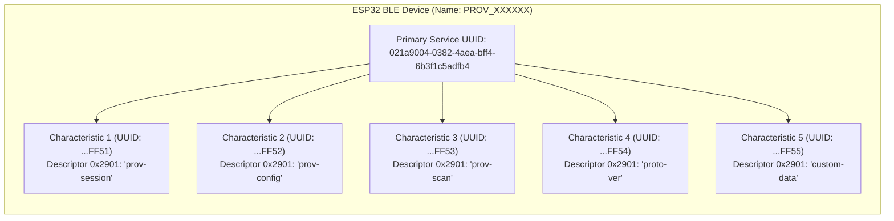
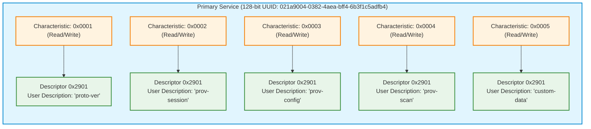
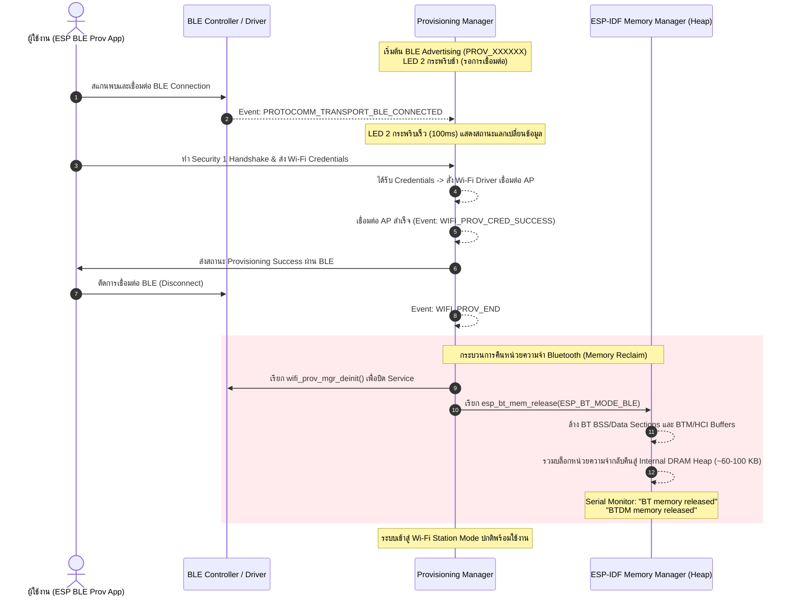

# ใบงานที่ 7.3 การคอนฟิก Wi-Fi ผ่าน BLE Scheme และการสืบสวน GATT Services (BLE Forensics)

## 0. กล่าวนำ (Introduction)
**Bluetooth Low Energy (BLE) Provisioning** เป็นรูปแบบมาตรฐานสากลที่อุปกรณ์ Smart Home ชั้นนำ (เช่น Apple HomeKit, Google Home, Matter Protocol) เลือกใช้ เนื่องจากผู้ใช้ไม่ต้องสลับการเชื่อมต่อ Wi-Fi บนสมาร์ตโฟน 

ในใบงานนี้ นักศึกษาจะได้สลับ ESP32 มาทำงานในโหมด **BLE Scheme (`wifi_prov_scheme_ble`)** พร้อมทั้งใช้เครื่องมือวิเคราะห์เชิงลึก **nRF Connect for Mobile** เพื่อส่องดูโครงสร้างภายในของ **GATT Primary Services, 128-bit UUIDs, Characteristics และ Descriptors** ก่อนจะทำการ Provisioning ผ่านแอป **ESP BLE Provisioning**

---

## 1. วัตถุประสงค์ (Objectives)
1. สามารถคอนฟิกตัวอย่าง `wifi_prov_mgr` ให้ทำงานในโหมด **BLE Transport Scheme** ได้สำเร็จ
2. สามารถใช้เครื่องมือ **nRF Connect for Mobile** ในการสแกนและตรวจสอบโครงสร้าง GATT Services/Characteristics ของ Protocomm บน ESP32
3. อ่านและวิเคราะห์ Descriptor `0x2901` (User Characteristic Description) เพื่อระบุชื่อ Protocomm Endpoints
4. ดำเนินการ Provisioning ผ่านแอปพลิเคชัน **ESP BLE Provisioning** และสังเกตการคืนหน่วยความจำ Bluetooth RAM (`BTDM memory released`)

---

## 2. อุปกรณ์และซอฟต์แวร์ที่ใช้ในการทดลอง
1. บอร์ดไมโครคอนโทรลเลอร์ ESP32 พร้อมสาย USB
2. สมาร์ตโฟนที่รองรับ BLE และติดตั้งแอปพลิเคชัน:
   - **nRF Connect for Mobile** (โดย Nordic Semiconductor)
   - **ESP BLE Provisioning** (โดย Espressif)
3. Wi-Fi Access Point ภายในห้องเรียนหรือ Hotspot

---

## 3. สถาปัตยกรรม GATT Services & Endpoints บน BLE Scheme



---

## 4. ขั้นตอนการทดลอง (Step-by-Step Procedures)

### ขั้นตอนที่ 1: การเปิดโปรเจกต์ Lab 7-3
1. เปิด Terminal ในโฟลเดอร์โปรเจกต์ `Week-07-W-iFi-Privisioning/Example_codes/Lab7-3-BLE-Provisioning`
2. โค้ดในโปรเจกต์นี้ได้รับการตั้งค่าเปิดใช้งาน **BLE Scheme (NimBLE)** และ **Security 1 (PoP: `abcd1234`)** ไว้เรียบร้อยแล้ว

---

### ขั้นตอนที่ 2: Build, Flash และตรวจสอบสถานะเริ่มต้น
1. สั่งล้าง Flash และ Flash โปรแกรมใหม่:
   ```powershell
   idf.py -p COM24 erase-flash flash monitor
   ```
2. สังเกต Log ใน Serial Monitor:
   ```text
   I (712) wifi_prov_scheme_ble: Starting BLE provisioning
   I (722) app: Starting provisioning
   I (732) app: Scan this QR code from the provisioning application for Provisioning.
   ... [QR Code ASCII & URL] ...
   ```

---

### ขั้นตอนที่ 3: ส่องโครงสร้าง GATT ผ่านแอป nRF Connect (BLE Forensic)
1. เปิดแอป **nRF Connect for Mobile** บนสมาร์ตโฟน
2. แตะปุ่ม **Scan** เพื่อค้นหาอุปกรณ์บลูทูธรอบตัว
3. ค้นหาชื่ออุปกรณ์ที่ขึ้นต้นด้วย `PROV_XXXXXX` (ตรงกับที่ระบุใน Serial Monitor)
4. สังเกตค่า RSSI และแตะปุ่ม **CONNECT** เพื่อเชื่อมต่อ
5. เมื่อเชื่อมต่อสำเร็จ สำรวจดู **GATT Services**:
   - มองหา **Unknown Service** ที่มี Base UUID `021a9004-0382-4aea-bff4-6b3f1c5adfb4`
   - ขยายดูรายการ Characteristics แต่ละตัว
   - สังเกตว่าในแต่ละ Characteristic จะมี Descriptor `Characteristic User Description` (`UUID 0x2901`) แตะดูค่า จะพบชื่อ Endpoint เช่น `"prov-session"`, `"prov-config"`, `"custom-data"`
6. บันทึกภาพหน้าจอและข้อมูล UUIDs ลงในตารางผลการทดลอง
7. กดปุ่ม **DISCONNECT** บนแอป nRF Connect เพื่อปล่อยบอร์ดให้พร้อมรับการ Provision

---

### ขั้นตอนที่ 4: ทำการ Provisioning ด้วยแอป ESP BLE Provisioning
1. เปิดแอป **ESP BLE Provisioning**
2. เลือก "Provision New Device" $\rightarrow$ เลือก "BLE"
3. แตะชื่อบอร์ด `PROV_XXXXXX` (หรือสแกน QR Code)
4. ป้อน PoP เป็น `abcd1234`
5. เลือกเครือข่าย Wi-Fi ในห้องเรียน และป้อนรหัสผ่าน Wi-Fi
6. กด **Provision** และรอจนกระทั่งเชื่อมต่อสำเร็จ

---

### ขั้นตอนที่ 5: สังเกตการปล่อยหน่วยความจำ Bluetooth (Memory Freeing)
สังเกตใน Serial Monitor หลังเชื่อมต่อ Wi-Fi สำเร็จ:
```text
I (24560) app: Provisioning successful
I (24570) wifi_prov_scheme_ble: BT memory released
I (24580) wifi_prov_scheme_ble: BTDM memory released
I (26120) app: Connected with IP Address: 192.168.1.155
```
> **ข้อสังเกต:** บอร์ดจะทำการล้างและคืนหน่วยความจำของ Bluetooth Stack ทั้งหมดคืนสู่ระบบ DRAM ทันที ทำให้ประหยัด RAM ได้มหาศาล!

---

---

## 5. กิจกรรมถอดรหัสซอร์สโค้ดและเขียนผังงาน (Code Deconstruction & BLE GATT Architecture Assignment)

### ภารกิจที่ 1: ผังโครงสร้าง GATT Tree & Endpoint Mapping



---

### ภารกิจที่ 2: ผังลำดับการคืนหน่วยความจำ Bluetooth (BLE Lifecycle & Memory Reclaim Flow)



---

## 6. ตารางบันทึกผลการทดลอง (Experiment Results)

| รายการตรวจสอบผลการทดลอง | ข้อมูลที่สังเกตได้ |
| :--- | :--- |
| **1. BLE Device Name ที่สแกนเจอ** | `PROV_A1B2C3` (ขึ้นต้นด้วย PROV_ ตามด้วย MAC 3 ไบต์ท้าย) |
| **2. Primary Service UUID (128-bit)** | `021a9004-0382-4aea-bff4-6b3f1c5adfb4` |
| **3. Characteristic Endpoint ที่พบ (Descriptor 0x2901)** | 1. `prov-session`<br>2. `prov-config`<br>3. `custom-data` (รวมถึง `proto-ver` และ `prov-scan`) |
| **4. พฤติกรรมไฟ LED 2 (GPIO 4) ช่วงรอ vs ช่วงต่อ BLE** | - **ช่วงรอเชื่อมต่อ:** กระพริบช้าเป็นจังหวะ (Slow Blink)<br>- **ช่วงต่อ BLE / ส่งข้อมูล:** เปลี่ยนเป็นกระพริบเร็วถี่ (Fast Blink 100ms) และติดค้างขณะประมวลผล |
| **5. พฤติกรรมเมื่อต่อ Wi-Fi สำเร็จ** | **มี** ข้อความ Log รายงานชัดเจน:<br>`I (...) wifi_prov_scheme_ble: BT memory released`<br>`I (...) wifi_prov_scheme_ble: BTDM memory released` |

---

## 7. คำถามท้ายการทดลอง (Post-Lab Questions)

1. **เหตุใด BLE Provisioning จึงไม่ส่งผลให้สัญญาณ Wi-Fi บนสมาร์ตโฟนของผู้ใช้หลุดระหว่างทำรายการ?**
   * **การแยกช่องสัญญาณสื่อสารทางกายภาพ (Independent Physical Layer):**
     * สมาร์ตโฟนเชื่อมต่อและส่งข้อมูลคอนฟิกไปยัง ESP32 ผ่านตัวรับส่งสัญญาณบลูทูธพลังงานต่ำ (**BLE Controller บนความถี่ 2.4 GHz**) ซึ่งทำงานเป็นอิสระจากชิปโมดูลและสแต็ก **Wi-Fi** ของโทรศัพท์
     * แตกต่างจาก SoftAP Mode ที่บังคับให้มือถือต้องตัดการเชื่อมต่อจาก Wi-Fi Router หลักเพื่อมาเกาะ Access Point ของบอร์ด แต่สำหรับ BLE สมาร์ตโฟนยังคงรักษาการเชื่อมต่อ Wi-Fi ประจำบ้านหรือ Cellular Data 4G/5G และใช้งานอินเทอร์เน็ตได้ต่อเนื่องแบบไร้รอยต่อ

2. **Descriptor 0x2901 มีความสำคัญอย่างไรต่อการที่แอปพลิเคชันมือถือจะทราบว่า Characteristic แต่ละตัวใช้ทำหน้าที่อะไร?**
   * **การทำ Service Discovery และ Endpoint Binding (RFC GATT Standard):**
     * รหัส `0x2901` คือมาตรฐาน Bluetooth SIG ที่เรียกว่า **Characteristic User Description Descriptor**
     * ตัว Characteristic ภายใต้ Protocomm Primary Service มักใช้เลข 128-bit UUID แบบสุ่มหรือค่าตัวเลขลำดับ (เช่น UUID ...0001, ...0002) ซึ่งแอปพลิเคชันภายนอกไม่สามารถทราบความหมายได้โดยตรง
     * เฟิร์มแวร์ ESP32 จึงแนบ Descriptor `0x2901` บรรจุสตริง ASCII เช่น `"prov-session"`, `"prov-config"`, หรือ `"custom-data"` ไว้ แอปมือถือ (เช่น ESP BLE Prov หรือ nRF Connect) เพียงแค่อ่านค่า Descriptor นี้ ก็จะรู้ได้ทันทีว่า Characteristic นี้คือท่อสื่อสาร (Endpoint Pipe) สำหรับส่งคีย์ความปลอดภัยหรือส่งข้อมูล Wi-Fi โดยไม่ต้อง Hardcode UUID ลงในแอป

3. **การที่ ESP-IDF มีฟังก์ชัน `esp_bt_mem_release()` มีประโยชน์อย่างไรต่อการทำงานของแอปพลิเคชัน IoT หลังเชื่อมต่อ Wi-Fi สำเร็จ?**
   * **การทวงคืนหน่วยความจำแรมอย่างมหาศาล (Heap Memory Reclaiming):**
     * โปรโตคอลสแต็ก Bluetooth และบลูทูธคอนโทรลเลอร์ (BTDM/NimBLE/Bluedroid) กินพื้นที่หน่วยความจำแรม (Internal SRAM) ไปเป็นจำนวนมาก (ประมาณ **60 – 100 กิโลไบต์**)
     * เมื่อกระบวนการ Provisioning จบลง อุปกรณ์ IoT ส่วนใหญ่จะใช้งานเพียง Wi-Fi เพื่อสื่อสารกับ Cloud/MQTT เท่านั้น และไม่มีความจำเป็นต้องใช้ Bluetooth อีกต่อไป
     * การเรียก `esp_bt_mem_release(ESP_BT_MODE_BLE)` จะสั่งให้ระบบปลดล็อกพื้นที่หน่วยความจำ BSS/Data Section ของโมดูล Bluetooth ทั้งหมด แล้วส่งคืนกลับเข้าไปเป็น **Free Heap Memory** ให้กับแอปพลิเคชันหลัก ทำให้ ESP32 มีแรมว่างเหลือเพียงพอสำหรับงานที่ใช้หน่วยความจำสูง เช่น TLS/HTTPS Handshake, บัฟเฟอร์ JSON, หรือการประมวลผลเซนเซอร์