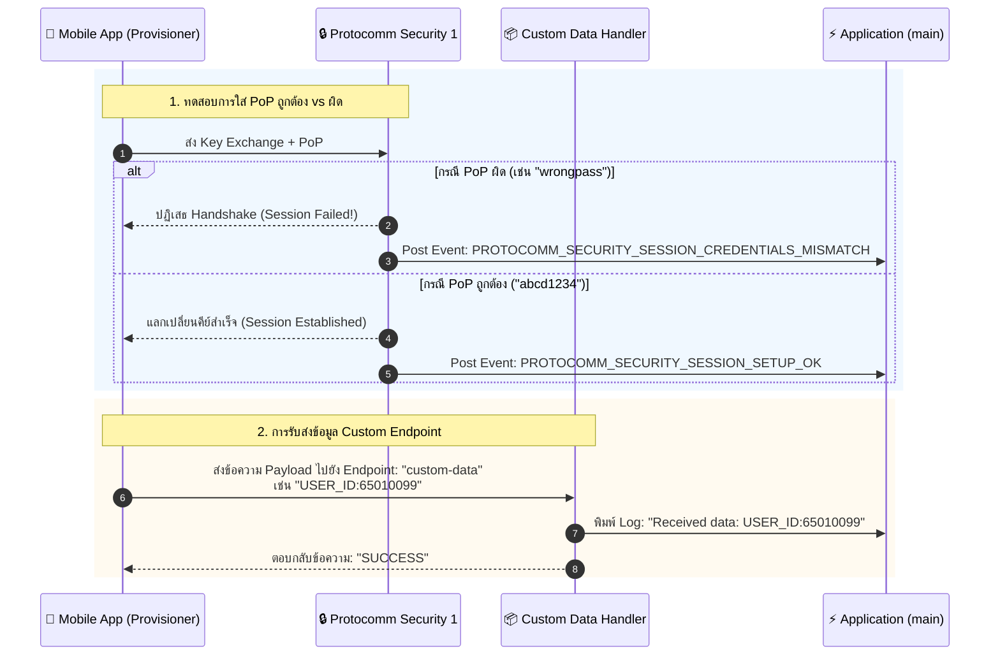
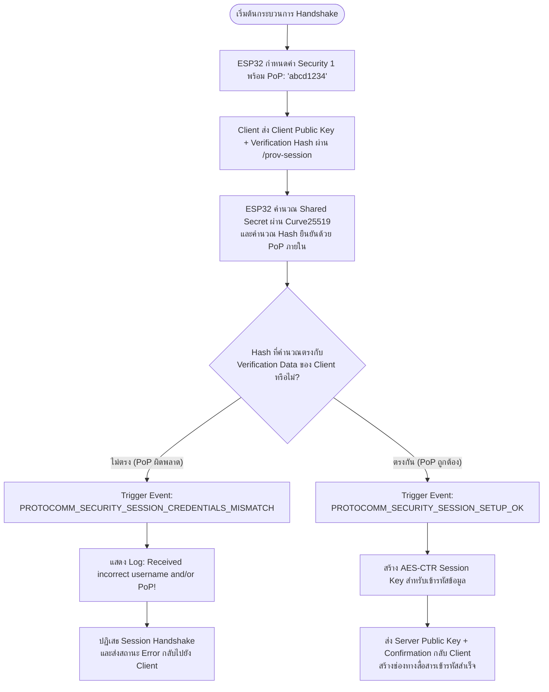
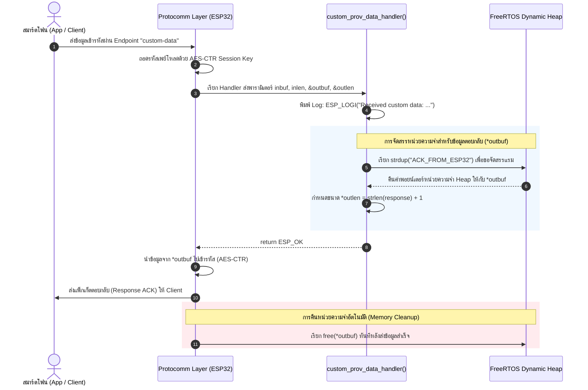

# ใบงานที่ 7.4: การทดสอบ Security Schemes (PoP) และการรับส่ง Custom Data Endpoints

## 0. กล่าวนำ (Introduction)
ในใบงานนี้ นักศึกษาจะได้ทดสอบเจาะลึกด้านความปลอดภัยของกระบวนการ Provisioning โดยทำการทดลองจำลองสถานการณ์ที่มีผู้ไม่หวังดีพยายามเชื่อมต่อด้วย **รหัส Proof-of-Possession (PoP) ที่ไม่ถูกต้อง** เพื่อสังเกตกลไกการปฏิเสธการเชื่อมต่อของ Protocomm Security Layer

นอกจากนี้ นักศึกษาจะได้เรียนรู้การเพิ่ม **Custom Data Endpoint (`custom-data`)** เพื่อรับส่งข้อมูลเฉพาะของแอปพลิเคชัน (เช่น Device ID, Owner Email, MQTT Broker URL หรือ Activation Code) ระหว่างมือถือและ ESP32 ในระหว่างขั้นตอน Provisioning

---

## 1. วัตถุประสงค์ (Objectives)
1. เข้าใจบทบาทและการทำงานของ **Proof-of-Possession (PoP)** ในการป้องกันการโจมตีแบบสวมรอย (Rogue Provisioning)
2. ทดลองจำลองกรณีป้อน PoP ผิด และสังเกต Event `PROTOCOMM_SECURITY_SESSION_CREDENTIALS_MISMATCH`
3. เข้าใจการลงทะเบียน Custom Endpoint ด้วย `wifi_prov_mgr_endpoint_create()` และ `wifi_prov_mgr_endpoint_register()`
4. สังเกตและวิเคราะห์การรับส่งข้อมูลผ่าน Custom Handler (`custom_prov_data_handler`)

---

## 2. อุปกรณ์และซอฟต์แวร์ที่ใช้ในการทดลอง
1. บอร์ดไมโครคอนโทรลเลอร์ ESP32 พร้อมสาย USB
2. สมาร์ตโฟนที่ติดตั้งแอปพลิเคชัน **ESP BLE Provisioning** หรือ **ESP SoftAP Provisioning**
3. Serial Monitor Tool

---

## 3. สถาปัตยกรรม Custom Endpoint & PoP Security Handshake



---

## 4. โค้ดส่วน Custom Data Handler ในตัวอย่าง `main.c`

พิจารณาการทำงานของฟังก์ชันจัดการข้อมูล Custom Endpoint:

```c
/* Handler สำหรับ Custom Endpoint ที่แอปพลิเคชันลงทะเบียนไว้ */
esp_err_t custom_prov_data_handler(uint32_t session_id, const uint8_t *inbuf, ssize_t inlen,
                                   uint8_t **outbuf, ssize_t *outlen, void *priv_data)
{
    if (inbuf) {
        ESP_LOGI(TAG, "Received custom data: %.*s", (int)inlen, (char *)inbuf);
    }
    
    // จัดเตรียมข้อความตอบกลับไปยังสมาร์ตโฟน
    char response[] = "ACK_FROM_ESP32";
    *outbuf = (uint8_t *)strdup(response);
    if (*outbuf == NULL) {
        ESP_LOGE(TAG, "System out of memory");
        return ESP_ERR_NO_MEM;
    }
    *outlen = strlen(response) + 1;

    return ESP_OK;
}
```

และขั้นตอนการลงทะเบียนใน `app_main()`:
```c
// 1. สร้าง Endpoint ก่อนเริ่ม Provisioning Service
wifi_prov_mgr_endpoint_create("custom-data");

// 2. เริ่มต้น Service
ESP_ERROR_CHECK(wifi_prov_mgr_start_provisioning(security, (const void *) sec_params, service_name, service_key));

// 3. ผูกฟังก์ชัน Callback เข้ากับ Endpoint หลังเริ่ม Service แล้ว
wifi_prov_mgr_endpoint_register("custom-data", custom_prov_data_handler, NULL);
```

---

## 5. ขั้นตอนการทดลอง (Step-by-Step Procedures)

### ตอนที่ 1: การเปิดโปรเจกต์และทดสอบ Security Handshake ด้วย PoP
1. เปิด Terminal ในโฟลเดอร์โปรเจกต์ `Week-07-W-iFi-Privisioning/Example_codes/Lab7-4-Custom-Data-and-Security`
2. สั่งล้าง Flash และรันโปรแกรม:
   ```powershell
   idf.py -p COM24 erase-flash flash monitor
   ```
3. เปิดแอป **ESP BLE Provisioning** สแกนหาบอร์ด ESP32
3. **การทดสอบที่ 1 (ป้อน PoP ผิด):**
   - เมื่อแอปถามรหัส PoP ให้พิมพ์รหัสผ่านมั่ว เช่น `wrong1234`
   - สังเกตปฏิกิริยาบนแอปมือถือและใน Serial Monitor:
     ```text
     E (15600) app: Received incorrect username and/or PoP for establishing secure session!
     ```
4. **การทดสอบที่ 2 (ป้อน PoP ถูกต้อง):**
   - สั่งรีเซ็ตบอร์ดใหม่ และเปิดแอปป้อน PoP เป็น `abcd1234` (ตรงกับค่าในโค้ด)
   - สังเกต Log:
     ```text
     I (18200) app: Secured session established!
     ```

---

### ตอนที่ 2: การรับส่งข้อมูลผ่าน Custom Endpoint
1. ในหน้าแอป **ESP BLE Provisioning** หลังผ่านขั้นตอนความปลอดภัยแล้ว ให้เข้าไปที่เมนู **Custom Data** หรือส่งข้อมูลผ่านแอปที่รองรับการเขียน Custom Endpoint
2. ป้อนข้อความ เช่น `STUDENT_ID:65010099` และกดส่ง
3. สังเกต Serial Monitor จะปรากฏข้อความที่ได้รับจากสมาร์ตโฟน:
   ```text
   I (22150) app: Received custom data: STUDENT_ID:65010099
   ```

---

---

## 6. กิจกรรมถอดรหัสซอร์สโค้ดและเขียนผังงาน (Code Deconstruction & Security Flow Assignment)

### ภารกิจที่ 1: ผังขั้นตอนการตรวจสอบ PoP (Security Handshake Decision Flow)



---

### ภารกิจที่ 2: ผังการรับส่งข้อมูลผ่าน Custom Endpoint (Custom Data Handler Flow)



> **เหตุผลที่ `*outbuf` ต้องจัดสรรใน Heap Memory:**
> ฟังก์ชัน `custom_prov_data_handler()` ทำงานแบบ Asynchronous เมื่อ Handler ทำงานเสร็จและคืนค่า `return ESP_OK` ตัวแปร Local Stack ภายในฟังก์ชันจะถูกทำลายทิ้งทันที หากใช้ตัวแปร Local Stack หรือ Local Static Array ข้อมูลจะสูญหายหรือไม่ปลอดภัยเมื่อ Protocomm Layer นำพอยน์เตอร์ไปประมวลผลเข้ารหัสและส่งข้อมูลในภายหลัง ดังนั้นจึงจำเป็นต้องจองพื้นที่ใน **Heap Memory** (ผ่าน `strdup()` หรือ `malloc()`) เพื่อให้หน่วยความจำคงอยู่จนกระทั่ง Protocomm ส่งข้อมูลเข้าเน็ตเวิร์กเสร็จสิ้น แล้ว Protocomm จะทำหน้าที่สั่ง `free(*outbuf)` คืนสู่ระบบให้โดยอัตโนมัติ

---

## 7. ตารางบันทึกผลการทดลอง (Experiment Results)

| สถานการณ์ทดสอบ | ค่า PoP ที่ป้อน | ผลลัพธ์บนแอปมือถือ | ข้อความ Log ใน Serial Monitor |
| :--- | :--- | :--- | :--- |
| **1. ป้อน PoP ผิดพลาด** | `wrong1234` | แอปแจ้งเตือนข้อผิดพลาด: *Invalid Proof of Possession (PoP)* หรือ *Authentication Failed* และปฏิเสธไม่ให้ดำเนินการต่อ | `E (...) app: Received incorrect username and/or PoP for establishing secure session!` |
| **2. ป้อน PoP ถูกต้อง** | `abcd1234` | ผ่านขั้นตอนการยืนยันตัวตนสำเร็จ เข้าสู่หน้าค้นหาและเลือกเครือข่าย Wi-Fi | `I (...) app: Secured session established!` |
| **3. ส่ง Custom Data** | `TEST_DATA_999` (หรือ `STUDENT_ID:67030120`) | แอปแสดงสถานะส่งสำเร็จ และได้รับข้อความตอบกลับ `ACK_FROM_ESP32` | `I (...) app: Received custom data: TEST_DATA_999`<br>(พร้อมสร้าง response outbuf ส่งกลับ) |

---

## 8. คำถามท้ายการทดลอง (Post-Lab Questions)

1. **การใช้ Proof-of-Possession (PoP) ช่วยป้องกันการโจมตีประเภทใดได้บ้าง?**
   * **Man-in-the-Middle (MitM) Attacks:** ป้องกันไม่ให้ผู้ไม่หวังดีที่ดักจับสัญญาณวิทยุสามารถสร้าง Session หลอกหรือสวมรอยเป็น Client/Server ระหว่างการแลกเปลี่ยนคีย์ Curve25519 เนื่องจากผู้โจมตีไม่มีรหัสลับ PoP สำหรับยืนยันตัวตน
   * **Rogue Provisioning / Device Hijacking:** ป้องกันบุคคลแปลกหน้าหรือผู้ไม่ได้รับอนุญาตที่อยู่ใกล้เคียง (เช่น เพื่อนบ้านหรือผู้ไม่หวังดีในรัศมีสัญญาณ BLE/SoftAP) แอบเชื่อมต่ออุปกรณ์แล้วส่ง Wi-Fi หลอกล่อเพื่อขโมยอุปกรณ์หรือนำอุปกรณ์ไปเกาะเข้าเครือข่ายอื่น
   * **Brute-Force Connection Attempts:** ช่วยเพิ่มความปลอดภัยด้วยกระบวนการตรวจสอบสิทธิ์ก่อนที่จะยอมเปิดให้เข้าถึง Endpoint ภายในระบบ

2. **หากไม่มีการใช้ PoP (เช่น ใน Security 0) ผู้โจมตีที่อยู่ในรัศมีสัญญาณบลูทูธสามารถทำสิ่งใดกับอุปกรณ์ได้บ้าง?**
   * **ขโมยข้อมูลและดักฟัง (Sniffing Plaintext Credentials):** เนื่องจาก Security 0 ไม่มีการเข้ารหัสข้อมูล ผู้โจมตีที่ใช้เครื่องมือดักจับแพ็กเก็ต (เช่น Wireshark หรือ BLE Sniffer) สามารถดักอ่านชื่อเครือข่าย (SSID) และรหัสผ่าน Wi-Fi (Password) ได้แบบข้อความธรรมดา (Cleartext) ทันที
   * **เข้าควบคุมและตั้งค่าอุปกรณ์โดยพลการ (Unauthorized Provisioning):** ใครก็ตามที่สแกนเจอสัญญาณสามารถส่งคำสั่งเชื่อมต่อ ยัดเยียด Wi-Fi Credentials ปลอม หรือส่ง Custom Data มุ่งร้ายเข้าสู่อุปกรณ์ได้ทันทีโดยไม่มีการขออนุญาต

3. **ในการประยุกต์ใช้งานเชิงพาณิชย์จริง เราสามารถนำ Custom Data Endpoint ไปใช้ส่งข้อมูลประเภทใดได้อีกบ้าง (ยกตัวอย่าง 2 กรณี)?**
   * **กรณีที่ 1: การลงทะเบียนอุปกรณ์และผูกบัญชีผู้ใช้ (Device Registration & Cloud Token Activation):**
     * ส่งข้อมูล **User Account Token**, **Owner UUID**, หรือ **API Key** จากสมาร์ตโฟนไปยังอุปกรณ์ เพื่อให้อุปกรณ์สามารถยืนยันตัวตนและผูกเข้ากับบัญชีคลาวด์ของผู้ใช้ (เช่น AWS IoT Core หรือ Firebase) ได้ทันทีที่ต่อเน็ตเวิร์กสำเร็จ
   * **กรณีที่ 2: การกำหนดค่าเซิร์ฟเวอร์เฉพาะขององค์กร (Private MQTT Broker URL & Enterprise Config):**
     * ส่ง URL ของเซิร์ฟเวอร์ภายใน (`mqtt://internal-broker.local:1883`), พอร์ต หรือใบรับรองดิจิทัล (TLS Client Certificate) เพื่อให้อุปกรณ์สามารถทำงานร่วมกับระบบ On-Premise ภายในโรงงานหรืออาคารสำนักงานได้โดยไม่ต้องคอมไพล์โค้ดใหม่แยกรายตัว

4. **ในฟังก์ชัน `custom_prov_data_handler()` เหตุใดหน่วยความจำที่จัดสรรให้ `*outbuf` จึงถูก Free โดย Protocomm Layer อัตโนมัติหลังจากส่งข้อมูลเสร็จ?**
   * **การออกแบบตามหลัก Ownership Transfer ใน API ของ Protocomm:**
     * เพื่อป้องกันปัญหา **หน่วยความจำรั่วไหล (Memory Leak)** ในระบบสมองกลฝังตัว
     * ฟังก์ชัน Handler ของแอปพลิเคชันมีหน้าที่เพียงสร้างและส่งมอบสิทธิ์การถือครอง (Transfer Ownership) ของพอยน์เตอร์ `*outbuf` ให้แก่ Protocomm Layer
     * เนื่องจากตัว Protocomm จำเป็นต้องใช้บัฟเฟอร์นี้ไปเข้ารหัสข้อมูลและส่งแพ็กเก็ตผ่านเน็ตเวิร์ก ซึ่งใช้เวลาแบบ Asynchronous หลังจากที่เฟรมข้อมูลถูกส่งออกทางวิทยุหรือทางซ็อกเก็ตเรียบร้อยแล้ว Protocomm Layer จึงมีหน้าที่เป็นผู้รับผิดชอบสุดท้ายในการสั่ง `free(*outbuf)` เพื่อคืนพื้นที่แรมกลับสู่ Heap อย่างถูกต้อง